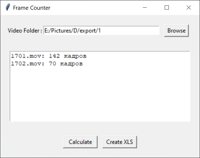

# 🎬 Frame Counter - Count Your Frames

**Frame Counter** - это десктопное приложение для подсчета количества кадров в видеофайлах и создания отчетов в формате Excel.

## ✨ Возможности

### 🎥 Работа с видео
- Поддержка популярных форматов: MP4, AVI, MOV, MKV
- Точный подсчет количества кадров в видео
- Быстрая обработка видеофайлов

### 📊 Отчеты
- Создание отчетов в формате Excel (.xlsx)
- Автоматическое форматирование таблиц
- Сохранение отчетов в выбранную папку

### 💾 Удобство использования
- Сохранение последнего выбранного пути
- Простой и интуитивно понятный интерфейс
- Отображение информации о найденных видео

## 🖥️ Системные требования

- **Python** 3.7 или выше
- **Операционная система**: Windows / Linux / macOS

## 📦 Установка

### 1. Клонирование репозитория

    bash
    
    git clone https://github.com/Geddity/frame_counter.git
    cd frame-counter

### 2. Установка зависимостей

    bash
    
    pip install opencv-python pandas openpyxl

#### Или используйте requirements.txt:
    bash
    
    pip install -r requirements.txt

### 3. Запуск приложения

    bash
    
    python frame_counter.py

## 🚀 Использование
### Основной рабочий процесс

#### Выберите папку с видео

- Нажмите кнопку "Browse"

- Выберите папку, содержащую видеофайлы

#### Подсчет кадров

- Нажмите "Calculate" для подсчета кадров

- Результаты отобразятся в текстовом поле

#### Создание отчета

- Нажмите "Create XLS" для создания Excel отчета

- Выберите место сохранения файла

- Отчет будет содержать таблицу с результатами

## 📁 Структура проекта

    frame-counter/
    ├── frame_counter.py    # Главный файл приложения
    ├── config.txt          # Файл конфигурации (создается автоматически)
    ├── requirements.txt    # Зависимости проекта
    ├── README.md          # Документация
    ├── LICENSE            # Лицензия
    └── screenshots/         # Скриншоты
       ├── fc.png
       └── thumb/             
            └── fc_th.png

## 📊 Формат отчета

Создаваемый Excel отчет содержит следующие колонки:
| Серия | Номер шота | Кол-во кадров |
|:-------|:----------:|:------:|
| папка_1 | видео_1 | 1234 |
| папка_1 | видео_2 | 567 |
| папка_1 | видео_3 | 890 |

- Все ячейки автоматически выравниваются по центру

- Ширина колонок автоматически подстраивается под содержимое

## 🛠️ Технические детали
### Поддерживаемые форматы видео
| Формат | Расширение | Статус |
|:-------|:----------:|:------:|
| MPEG-4 | .mp4 | ✅ |
| AVI | .avi | ✅ |
| QuickTime | .mov | ✅ |
| Matroska | .mkv | ✅ |

### Алгоритм работы

- Сканирование выбранной папки на наличие видеофайлов

- Для каждого видео открытие видеопотока с помощью OpenCV

- Пошаговое чтение кадров до конца файла

- Сохранение результатов в текстовом виде и Excel отчете

## 🔧 Конфигурация

Приложение автоматически сохраняет последний выбранный путь в файл config.txt. При следующем запуске путь будет восстановлен.

## 🐛 Известные проблемы и решения
### Проблема: медленный подсчет кадров для больших видео

Решение: Для очень больших видеофайлов подсчет может занимать время. Рекомендуется использовать видео в формате MP4 с умеренным разрешением.

## 📄 Лицензия

Этот проект распространяется под лицензией MIT. Подробности в файле LICENSE.

## 📸 Скриншоты

